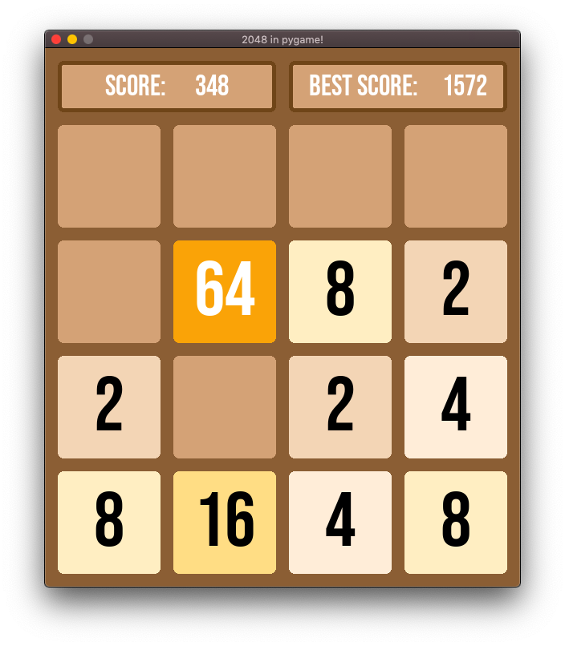

# 2048 Python/Pygame

This is 2048 game written in Python and Pygame module. It applies mostly all Pygame
features (sound, graphics, etc.).

## Application design

1. Numbers generates
2. User presses keyboard keys
3. Numbers combines
4. 1, 2, 3 until number 2048 combines

## Logic

Core check-list:

- [x] random number generation
- [x] moving tiles
- [x] merging

Check-list (features, design):

- [x] best score file i/o
- [x] game over, you won (splash screen)
- [x] game buttons
- [x] audio effects, sounds, music (soundtrack, background music)
- [x] refactor code
  * [x] improve moving algorithms
  * [x] calculate precise game over

## Development

Game development:

- project-oriented, you care more about the actual game you will create.

- development-oriented, you care about the process, skills you will get.

- I'm development-oriented:
  
  * features should test all game functionality (something I didn't do)

Game assets (different game development skills):

1. Buy/download assets from the internet
2. Make rough assets yourself
3. Ask your (different game development skills) friend
